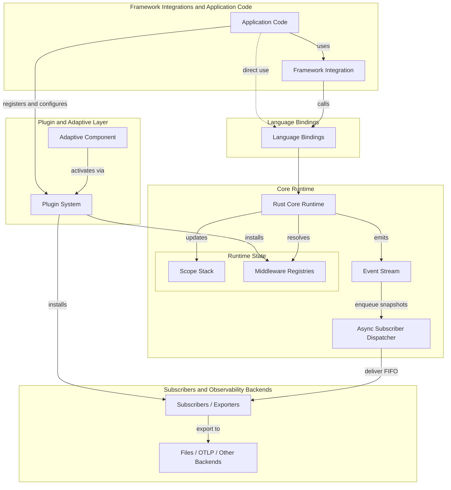

import { MermaidStyles } from "@/components/MermaidStyles";

{/* SPDX-FileCopyrightText: Copyright (c) 2026, NVIDIA CORPORATION & AFFILIATES. All rights reserved.
SPDX-License-Identifier: Apache-2.0 */}

This page explains how NeMo Relay connects scopes, middleware, plugins, events,
subscribers, and exporters.

## Architecture Diagram

This diagram connects the runtime pieces to the layers they inhabit.

<MermaidStyles />



Adaptive appears here as a built-in plugin component rather than a separate runtime model because it activates through the same plugin lifecycle.

## Runtime Model

NeMo Relay combines a small number of runtime pieces into one shared execution model:

- The **scope stack** answers where work belongs
- The **middleware registries** answer what should happen around that work
- The **plugin system** installs reusable runtime behavior from configuration
- The **event stream** records what happened
- The **async subscriber dispatcher** delivers event snapshots after emission
- **subscribers** consume those events

Every emitted scope, tool, LLM, or mark event attaches to the active scope stack. Every managed tool or LLM call resolves the currently visible middleware before it executes.

## Main Runtime Pieces

These components are the primary building blocks that make up the runtime model.

### Scope Stack

The active scope stack defines the ownership tree for runtime work. It establishes:

- Parent-child relationships between events
- Scope-local visibility for middleware and subscribers
- Cleanup boundaries for scope-owned registrations
- Isolation across concurrent requests or workers

### Middleware Registries

The middleware registries hold the active intercepts and guardrails for tool and LLM execution. Managed helpers read those registries before invoking the real callback.

### Plugin System

The plugin system installs reusable runtime components from configuration. A plugin can register middleware, subscribers, or related behavior without requiring each application call site to do the work manually.

### Event Emission

The runtime emits structured events for scopes, tools, LLMs, and named marks. Those events are the canonical record of runtime behavior. Native Rust, Python, Node.js, and FFI event-producing APIs enqueue subscriber work and return without waiting for subscriber callbacks or exporter work.

### Subscribers and Exporters

Subscribers consume the event stream through the background dispatcher. Some subscribers stay in-process. Others export that stream into files or tracing systems. Use the binding flush API when a test or shutdown path must wait for already-queued subscriber work.

## Two Axes of Runtime State

Runtime state is easiest to understand by separating ownership from process-wide
registration.

### Scope Ownership

The scope stack defines:

- Where work belongs
- Which scope-local behavior is visible
- When scope-local registrations are cleaned up
- Whether concurrent requests stay isolated

### Middleware Ownership

Middleware exists at two levels:

- **global registrations** stay active process-wide until removed
- **scope-local registrations** are owned by one scope and disappear when that scope closes

That split lets long-lived defaults coexist with request-specific or task-specific behavior.

## Managed Execution Pipeline

Managed tool and LLM execution follows the same high-level order:

1. Conditional-execution guardrails decide whether work can proceed.
2. Request intercepts can rewrite the real request.
3. Sanitize-request guardrails can rewrite the emitted start-event payload.
4. Execution intercepts wrap or replace the user callback.
5. The user callback runs.
6. Sanitize-response guardrails can rewrite the emitted end-event payload.

Two distinctions matter:

- Intercepts affect the real execution path
- Sanitize guardrails affect the emitted observability payload

For the expanded request-to-response runtime path, including streaming and subscriber handoff, see [Middleware](/about-nemo-relay/concepts/middleware#detailed-execution-flow).

## Runtime Layers

From bottom to top, NeMo Relay is organized as:

1. The Rust core runtime
2. The plugin and adaptive layer
3. Language bindings
4. Framework integrations and application code
5. Subscribers and observability backends

The details of a binding can vary, but the conceptual model stays the same across those layers.

## Integration Entry Points

Choose an entry point based on who owns the real LLM or tool callback. Relay
can apply the full managed execution pipeline only when it can wrap that
callback.

| Integration Path | Callback Owner | Relay Entry Point | Full Managed Execution | Authoritative Guide |
| --- | --- | --- | --- | --- |
| CLI-wrapped coding agents | The coding-agent host owns the callback. | The Relay CLI wraps the host, receives lifecycle hooks, and can route supported provider traffic. | Available only for boundaries that the host exposes to Relay; hook-only events do not run the managed pipeline. | [NeMo Relay CLI](/nemo-relay-cli/about) |
| Direct managed SDK calls | The Rust, Python, or Node.js application owns the callback. | Managed LLM and tool helpers wrap the application callback. | Yes. | [Instrument Applications](/instrument-applications/about) |
| Maintained public framework integrations | The framework owns the callback; its public integration point determines whether Relay can wrap it. | A maintained adapter uses public framework APIs. | Integration-dependent. | [Supported Integrations](/supported-integrations/about) |
| Configured in-process plugins | The host process owns callbacks and initializes Relay plugin configuration. | Plugin components install middleware, subscribers, exporters, or related runtime behavior. | Middleware receives managed semantics when the underlying call uses a managed entry point. | [Build Plugins](/build-plugins/about) |
| Native or gRPC worker plugins | The plugin implementation owns its native or worker-process behavior; the instrumented host still owns application callbacks. | The plugin runtime loads a native component or communicates with a gRPC worker. | Limited to the behavior and callback boundary exposed through the plugin interface. | [Rust Dynamic Plugin API](/reference/api/rust-library-reference/nemo-relay/plugin/dynamic) |

Framework authors who need a new wrapper or lifecycle boundary should start
with [Integrate into Frameworks](/integrate-into-frameworks/about).

## Installation Surfaces

Install the package that matches the boundary Relay needs to observe or
control:

```bash
# Rust application SDK
cargo add nemo-relay

# Rust direct memory provider API and reference implementation
cargo add nemo-relay-memory

# Python application SDK
uv add nemo-relay

# Node.js application SDK
npm install nemo-relay-node

# Coding-agent CLI wrapper
cargo install nemo-relay-cli
```

Gateway and CLI plugin behavior can also be activated from a project-level
`.nemo-relay/plugins.toml` file. Refer to
[Installation](/getting-started/installation) for the authoritative
prerequisites, supported versions, framework extras, and package-manager
commands. Refer to [Plugin Configuration Files](/build-plugins/plugin-configuration-files)
for plugin file discovery and precedence.

The shipped memory surface is a direct Rust provider API and deterministic
in-memory reference implementation. It does not activate automatic recall or
write-back. Refer to the generated
[`nemo-relay-memory` library reference](/reference/api/rust-library-reference/nemo-relay-memory)
for its provider, runtime, and conformance symbols. The broader automatic
integration remains a [design proposal](/contribute/memory-runtime-design).

## Runtime Outputs

ATOF 0.1 events are Relay's canonical runtime record. In-process subscribers
consume snapshots from the same event stream, while exporters project those
events into formats intended for other systems. A projection does not redefine
scope ownership, middleware ordering, or provider payload semantics.

The following table compares each output and its intended consumer.

| Output | Producer and Consumer | Typical Artifact or Destination | Choose It When |
| --- | --- | --- | --- |
| [ATOF](/observability-plugin/atof) | The core emits events; subscribers and raw-event collectors consume them. | JSONL files or streamed raw events. | You need the canonical event shape for debugging, replay inputs, or a custom consumer. |
| [In-process subscribers](/about-nemo-relay/concepts/subscribers) | The async dispatcher delivers event snapshots to application- or plugin-registered callbacks. | Application state, queues, or custom exporters. | Runtime-local logic should react to events without changing managed execution. |
| [ATIF](/observability-plugin/atif) | The ATIF exporter groups events for downstream trajectory consumers. | One trajectory artifact per top-level agent run, written locally or to configured storage. | Evaluation or analysis needs normalized agent steps and lineage. |
| [OpenTelemetry](/observability-plugin/opentelemetry) | The OpenTelemetry exporter maps Relay events to trace spans. | An OTLP collector or configured tracing backend. | Operations teams use standard distributed tracing infrastructure. |
| [OpenInference](/observability-plugin/openinference) | The OpenInference exporter maps Relay events to AI-semantic trace spans. | An OpenInference-compatible tracing backend. | Model and agent analysis benefits from OpenInference conventions. |

## Source Layout

Rust defines runtime behavior. Python and Node.js are the other primary
supported bindings. Go, WebAssembly, and the raw C FFI are experimental,
source-first surfaces.

The following table maps repository paths to their responsibilities.

| Path | Responsibility |
| --- | --- |
| `crates/core` | Scope, managed execution, middleware, events, subscribers, and runtime behavior. |
| `crates/types` | Shared event, plugin, and cross-crate data types. |
| `crates/memory` | Direct provider-neutral memory runtime, deterministic in-memory provider, and adapter conformance helpers. |
| `crates/plugin` | Plugin contracts, configuration, validation, and lifecycle. |
| `crates/worker-proto` and `crates/worker` | Protocol definitions and runtime support for out-of-process plugin workers. |
| `crates/adaptive` | Adaptive runtime primitives and plugin components. |
| `crates/python` and `python/nemo_relay` | The PyO3 extension and public Python wrapper package. |
| `crates/node` | Native Node.js binding and JavaScript or TypeScript entry points. |
| `crates/ffi` | Experimental raw C ABI used by downstream bindings. |
| `go/nemo_relay` | Experimental Go binding over the C FFI. |
| `crates/wasm` | Experimental WebAssembly binding and JavaScript wrappers. |
| `docs` | Public documentation source. |
| `patches` | Relay changes maintained as third-party integration patch sets. |
| `third_party` | Pinned upstream source checkouts used to develop and verify patches. |

## Design Goal

NeMo Relay is designed so that application developers, framework integrators, plugin authors, and observability consumers all reason about the same runtime semantics. One conceptual model should remain stable even when the binding or integration style changes.

## Related Concepts

The following concepts are related to this architecture:

- [Scopes](/about-nemo-relay/concepts/scopes)
- [Middleware](/about-nemo-relay/concepts/middleware)
- [Events](/about-nemo-relay/concepts/events)
- [Subscribers](/about-nemo-relay/concepts/subscribers)
- [Plugins](/about-nemo-relay/concepts/plugins)
- [Codecs](/about-nemo-relay/concepts/codecs)
