import { MermaidStyles } from "@/components/MermaidStyles";

{/* SPDX-FileCopyrightText: Copyright (c) 2026, NVIDIA CORPORATION & AFFILIATES. All rights reserved.
SPDX-License-Identifier: Apache-2.0 */}

<Warning>
This page combines shipped reference behavior with a staged design. The
implementation-status section is authoritative about what is available now;
later sections label future work explicitly.
</Warning>

This design defines the shipped memory foundation and the remaining integration
work. It builds on the current [Relay architecture](/about-nemo-relay/architecture),
[plugin lifecycle](/about-nemo-relay/concepts/plugins),
[event contract](/about-nemo-relay/concepts/events), and
[Adaptive Cache Governor](/adaptive-plugin/acg).

## Implementation Status

The provider, automatic, local background, and prompt-cache coordination slices
are implemented.
The shipped surface includes the following pieces:

- Serializable DTOs in `nemo-relay-types::memory`
- The object-safe provider contract and deadline-enforcing direct runtime in
  `nemo-relay-memory`
- A deterministic, network-free in-memory provider and reusable conformance
  report
- A generic asynchronous prepare/complete lifecycle seam for ordinary
  non-streaming managed LLM calls
- Deterministic automatic recall, codec-aware tagged injection, inline or
  bounded background projected write-back, and references-only categorized
  evidence
- A process-local bounded queue with typed retry policy, provider idempotency,
  inspection, watermark flush, drain, and shutdown
- A typed maintenance checkpoint/window, object-safe maintainer policy, and
  deterministic derived-artifact implementation with parent provenance
- An asynchronous worker-plugin shutdown callback over the existing worker RPC
- Global, scope-local, and plugin installation backed initially by the native
  in-memory provider
- Typed Python and Node.js reference components at `nemo_relay.memory` and
  `nemo-relay-node/memory`
- Optional direct Python adapters for Mem0 OSS 2.x and Hindsight 0.8 with a
  shared supported-conformance report and no default vendor dependencies
- Hindsight Reflect maintenance that retains a derived record and preserves
  exact provider evidence references
- Prompt IR classification that keeps automatic memory outside the learned
  stable cache prefix
- Hash-only memory/cache correlation in adaptive request facts and telemetry

`MemoryRuntime` still provides direct provider access only. Automatic behavior
starts only after an application installs `MemoryComponent`,
`InMemoryAutomaticMemory`, or the built-in `memory` plugin component. The
following remain future work: durable/distributed queues, arbitrary Python/Node
provider bridges into automatic execution, Graphiti/Cognee/Hivemind adapters,
attribution and evaluation, and the agent UI demonstration. Streaming managed
LLM calls reject visible lifecycle hooks instead of applying partial memory
behavior.

## Reference-Mode Setup

Each primary binding installs one component and then uses its ordinary managed
LLM API. Agent code does not call search or store.

### Python

```python
from nemo_relay import LLMRequest, codecs, llm, memory

component = memory.InMemoryAutomaticMemory(
    memory.AutomaticMemoryConfig(
        namespace=memory.MemoryNamespace("demo", "alex"),
    )
).install()

try:
    result = await llm.execute(
        "provider",
        LLMRequest({}, {
            "model": "demo-model",
            "messages": [{"role": "user", "content": "What do I prefer?"}],
        }),
        call_provider,
        codec=codecs.OpenAIChatCodec(),
        response_codec=codecs.OpenAIChatCodec(),
    )
finally:
    component.close()
```

### Node.js

```javascript
const relay = require('nemo-relay-node');
const { InMemoryAutomaticMemory } = require('nemo-relay-node/memory');

const component = new InMemoryAutomaticMemory({
  namespace: { tenantId: 'demo', subjectId: 'alex' },
}).install();

try {
  const codec = new relay.OpenAIChatCodec();
  const result = await relay.llmCallExecuteAsync(
    'provider', request, callProvider,
    null, null, null, null, null,
    codec.decode.bind(codec),
    (payload) => codec.encode(payload.annotated, payload.original),
    codec.decodeResponse.bind(codec),
  );
} finally {
  component.close();
}
```

### Rust

```rust
let component = MemoryComponent::new(
    InMemoryProvider::new(),
    AutomaticMemoryConfig {
        namespace: Some(MemoryNamespace::new("demo", "alex")?),
        ..AutomaticMemoryConfig::default()
    },
)?;
let _installation = component.install_global("memory", 0)?;

// The provider callback receives the prepared request. No search/store call is
// present at this call site.
let result = llm_call_execute(params_with_openai_chat_codec).await?;
```

To move only completed-turn storage off the response path, set
`write_delivery`/`writeDelivery` to `background`. Recall remains synchronous so
the current request can use it. Applications should deregister the hook and
await queue shutdown during process handoff:

```python
component = memory.InMemoryAutomaticMemory(
    memory.AutomaticMemoryConfig(
        namespace=memory.MemoryNamespace("demo", "alex"),
        write_delivery=memory.WriteDelivery.BACKGROUND,
        background_queue=memory.MemoryWorkQueueConfig(capacity=32),
    )
).install()

try:
    result = await llm.execute(...)
    await component.flush()
finally:
    await component.shutdown()
```

Node.js exposes the same lifecycle as `backgroundStatus`,
`backgroundJobStatus(jobId)`, `flush()`, `drain()`, and `shutdown()`. Rust uses
the corresponding `MemoryComponent` background methods.

The Python `MemoryProvider` contract now has direct Mem0 OSS and Hindsight
implementations. Those language-defined objects cannot yet be passed to the
native automatic component. The Node contract remains an adapter boundary.

## Problem and Goals

An agent should be able to gain long-term memory by activating one Relay
component. The agent should not need to call a provider-specific retrieval API,
copy retrieved text into every prompt, or remember to store outcomes after each
turn.

The staged runtime design will:

- Present one provider-neutral contract across local stores, remote services,
  temporal graphs, and organizational learning systems
- Retrieve bounded context before a managed LLM callback, write back the
  configured projection, and later support a bounded background handoff
- Keep tenant and subject identity explicit across concurrent agents
- Record which items were retrieved, injected, cited, or attributed without
  overstating causality
- Support asynchronous consolidation, reflection, and skill learning without
  delaying the primary agent
- Coordinate dynamic memory placement with prompt-cache planning
- Expose lifecycle evidence that a reproducible evaluation harness can score

## Non-Goals

The first version will not:

- Replace a provider's storage engine, graph model, embeddings, or ranking
- Make every provider pretend to support update, deletion, reflection, or skill
  generation
- Add vendor SDKs to the default Rust, Python, or Node.js dependency closure
- Treat semantic memory storage as a prompt-cache backend
- Claim that a retrieved memory affected an answer without citation or
  evaluator evidence
- Provide distributed exactly-once queues or complete Go, WebAssembly, and raw
  C FFI parity
- Publish final Rust function signatures in this proposal

## Options Considered

The following table compares four possible integration boundaries.

| Option | Strengths | Limits | Decision |
| --- | --- | --- | --- |
| middleware-only vendor plugins | Fast path to one provider and natural request interception. | Repeats identity, evidence, queue, and binding behavior for every vendor; makes evaluation provider-specific. | Reject as the common contract. Vendor adapters can still install through the plugin. |
| first-class core service | Makes memory directly available beside core scopes and middleware. | Expands the core and binding surface before semantics are proven and increases pressure to add vendor dependencies. | Defer unless the companion boundary later proves too limiting. |
| companion memory crate plus plugin automation | Isolates a changing domain, supports direct and automatic use, reuses plugin activation, and allows conformance tests. | Requires a new workspace crate and carefully designed binding exports. | Select. |
| subscriber-only ingestion | Keeps write processing off the hot path and supports replay from ATOF. | Cannot provide automatic pre-call retrieval and can ingest sanitized or incomplete payloads. | Retain as an optional write source, not the primary design. |

## Decision

Select **companion memory crate plus plugin automation**.

Serializable provider-neutral DTOs live in `nemo-relay-types`.
`nemo-relay-memory` owns the provider contract, in-memory reference
implementation, conformance helpers, automatic component, bounded queue, and
maintainer lifecycle. Optional baseline adapters live in the Python package;
additional provider profiles remain staged work.
The existing plugin system validates, initializes, reports, replaces, and
clears components. Direct components expose deterministic queue drain and
shutdown. Out-of-process plugins reuse the existing authenticated worker
shutdown RPC instead of creating a second service lifecycle.

Python exposes the reference feature through `nemo_relay.memory`, and Node.js
exposes it through `nemo-relay-node/memory` in their existing distributions.
Rust, Python, and Node.js are the primary implementation targets. Provider SDKs
remain optional extras or service adapters.

## Package and Repository Boundaries

| Owner | Proposed Responsibility |
| --- | --- |
| `nemo-relay-types` | Serializable memory DTOs, capability declarations, operation results, and event profile data shared by core, bindings, native plugins, and worker protocols. |
| `nemo-relay-memory` | Shipped async provider contract, reference provider and maintainer, bounded local queue, automatic policy, deterministic selection, write projection, and conformance tests; future provider factories and adapters. |
| NeMo Relay core and plugin crates | Generic categorized mark support, plugin activation and cleanup hooks, scopes, middleware ordering, subscribers, and exporters. |
| Python and Node.js distributions | Ergonomic `nemo_relay.memory` and `nemo-relay-node/memory` entry points without mandatory vendor dependencies. |
| Optional adapters | Provider-specific SDK or service mappings, capability differences, and native metadata preservation. |
| NeMo Relay repository | DTOs, runtime and component code, supported bindings, events, conformance tests, integration documentation, and reference examples. |
| `nemo-agent-memory` repository | Relay benchmark adapter, pinned memory-service configurations, demo backend and agent, scripted recall scenario, evaluation output, and a thin evidence UI. |

The first vertical slice will not modify NeMo Agent Toolkit UI. The demo can
reuse its interaction patterns later if a thin UI cannot communicate the
evidence clearly. Before changing `nemo-agent-memory`, contributors must fetch
the current remote state, read that repository's instructions, fast-forward
safely, and create a dedicated feature branch.

## Provider Contract

Only asynchronous `search` and `store` operations are required. Providers will
declare typed capabilities for update, delete or forget, batch ingestion,
reflect or consolidate, feedback or attribution, and health. Callers must check
`MemoryCapabilities` rather than inferring support from a provider name.

The neutral vocabulary includes `MemoryNamespace`, `MemorySearchRequest`,
`MemoryRecord`, `MemoryStoreRequest`, `MemoryProvenance`,
`MemoryCapabilities`, and `MemoryOperationError`. Terms such as bank, graph,
episode, or dataset belong inside adapters.

A returned `MemoryRecord` preserves:

- Provider name and stable provider item ID
- Score and rank
- Event and ingestion timestamps
- Content or an opaque reference
- Structured `MemoryProvenance`
- Neutral metadata and a provider-native metadata escape hatch

Provider and automation errors are typed. Retrieval defaults to a
deadline-bounded fail-open policy after identity has been resolved: the model
call continues without memory if the provider is unavailable. Storage is inline
and fail open by default. Background mode makes admission and later delivery
states separately observable. Fail-closed admission can fail lifecycle
completion; a provider failure after accepted background admission cannot
retroactively fail an already-returned callback result.

## Identity and Isolation

`MemoryNamespace` contains required `tenant_id` and `subject_id` fields and
optional `session_id` and `agent_id` fields. A demo can configure a named local
tenant. Automatic mode does not invent a subject.

Shipped automatic identity resolution uses this precedence:

1. Per-call override
2. Active scope metadata
3. Component-supplied static namespace

The control object is `metadata.memory`, with optional `enabled` and `namespace`
fields. Tenant and subject are required. If either is absent, the component
emits a typed failure fact and applies its configured policy. Identity defaults
to fail closed for isolation. A demo can explicitly choose fail-open behavior.
Concurrent-isolation tests prove that no result crosses a `tenant_id` or
`subject_id` boundary.

## Automatic Retrieval and Write-Back

Automatic retrieval operates at ordinary non-streaming managed LLM boundaries.
A call or visible scope can set `metadata.memory.enabled=false`; the call then
performs no search, injection, or write. Streaming calls reject a visible
lifecycle hook explicitly.

The query uses the latest non-memory user content. It never queries an already
injected memory envelope. Selection is deterministic: validate the provider
result, deduplicate stable memory IDs, preserve score order with stable-ID tie
breaking, and then enforce item and estimated-token budgets.

The call's request codec renders a versioned `<relay_memory>` block as explicitly
untrusted context and prepends it to the triggering user content. Literal tag
delimiters inside memory records are Unicode-escaped before budgeting and
rendering, so a record cannot close the envelope early. Stable system and
developer instructions remain ahead of that volatile block. The callback and
LLM start event receive the same prepared request. Write projection retains the
original user content and, by default, normalized assistant content; it excludes
tagged injected blocks to prevent recursive memory pollution.

The exact non-streaming order is conditional guardrails, request intercepts,
ascending-priority lifecycle preparation, start-event sanitization/emission,
execution intercepts and provider callback, reverse-order lifecycle completion,
then response sanitization/end-event emission. Inline delivery awaits the
provider store inside lifecycle completion. Background delivery admits the
store to the bounded queue before returning lifecycle completion; the queue then
applies explicit typed retries. Retrieval and storage admission have independent
fail-open/fail-closed policies.

The reference component uses these defaults:

| Setting | Default |
| --- | --- |
| Search scope | Subject within the required tenant/subject partition |
| Provider candidates | 20 |
| Injected items | 5 |
| Estimated injected tokens | 512 |
| Search and store timeout | 2,000 milliseconds each |
| Missing identity | Fail closed |
| Retrieval or injection failure | Fail open |
| Storage failure | Fail open |
| Write projection | Original user and normalized assistant content |
| Write delivery | Inline |
| Background pending capacity | 64 |
| Background attempts | 3 |
| Evidence capture | References only |

The following diagram separates synchronous recall from the two shipped
write-back delivery modes.

```mermaid
flowchart LR
    Request[Managed LLM request] --> Identity[Resolve explicit namespace]
    Identity --> Search[Provider search with deadline]
    Search --> Select[Filter, deduplicate, rank, and budget]
    Select --> Inject[Codec-aware tagged injection]
    Inject --> Callback[Existing managed callback pipeline]
    Callback --> Complete[Lifecycle completion]
    Complete --> Mode{Write delivery}
    Mode -->|inline| Store[Await projected provider store]
    Mode -->|background| Queue[Bounded queue admission]
    Store --> Result[Return callback result]
    Queue --> Result
    Queue --> Async[Store or maintenance worker]
    Async --> Store

    class Request purple-lightest;
    class Identity,Search,Select,Inject,Complete,Store green-light;
    class Callback green;
    class Result yellow-lightest;
    class Mode,Queue,Async blue-lightest;
```

<MermaidStyles />



## ATOF Evidence and Privacy

The implementation extends the generic mark-event surface with optional
category, category profile, data schema, and LLM-parent values. It does not add
a memory-only event bypass.

Shipped operations emit versioned marks with category `memory`, subtypes
`retrieval`, `injection`, `storage`, and `failure`, and data schema
`nemo.relay.memory.operation` version `0.1`. Background storage marks add
`queued`, `running`, `retrying`, `rejected`, `failed`, and `cancelled` states to
the inline `stored` and `skipped` outcomes. Marks carry status, policy,
provider, a hashed namespace reference, item references, ranks or scores,
content hashes and lengths, latency where measured, and correlation IDs. The
managed LLM call is the parent. `storage` with status `skipped` distinguishes
callback failure or missing writable content from a successful store.

The only shipped capture mode is `references`: stable IDs, hashes, lengths,
scores, and provider references without raw memory, query, or answer text. Raw
or redacted content modes are not supported. Export and retention policy must
still treat references-only evidence as potentially sensitive.

Evidence keeps these states separate:

| State | Shipped | What Relay Can Claim |
| --- | --- | --- |
| Retrieved | Yes | The provider returned the item. |
| Injected | Yes | Selection placed the item in the real model request. |
| Stored | Yes | The configured original-turn projection reached the provider. |
| Failed | Yes | A named memory stage failed under the recorded policy. |
| Cited | No | A future supported citation mechanism explicitly referenced the item. |
| Attributed | No | A future evaluator judged the item relevant, with a recorded method and confidence. |

Retrieval is not use. Strong causal claims require a paired ablation that runs
the same case without the candidate memory. If operation marks prove
insufficient, a first-class memory scope or category will be considered only
after exporter and binding evidence justifies it.

## Asynchronous Maintenance and Dreaming

Reflection and consolidation are maintenance jobs above the provider contract.
`MemoryMaintenanceWindow` supplies an explicit namespace, checkpoint,
predecessor, query, scope, filters, and bound. `MemoryMaintainer` owns derivation
policy separately from provider persistence. `ReferenceMaintainer` writes one
versioned deterministic artifact and records the checkpoint plus every parent
memory in provenance. Provider-native reflect or improve calls and LLM-backed
dreaming agents can implement the same policy boundary.

Local maintainers use the shipped bounded queue with typed retries, idempotency
keys, inspection, flush, drain, and shutdown deadlines. The queue is
process-local and at-least-once; process-crash durability and distributed
exactly-once coordination remain future work. The primary agent reads the
latest committed snapshot without waiting for a maintenance job.

Heavy or remote maintainers use the existing native or gRPC worker-plugin
boundary. A worker owns its provider client, schedule, and queue. The host
already sends the authenticated worker `Shutdown` RPC before process
termination; the Rust SDK now awaits `WorkerPlugin::shutdown(reason)` so the
plugin can close admission and drain. This is a lifecycle seam, not a new
memory service. ATOF marks are evidence and are not a durable command bus.

[Letta sleep-time compute](https://www.letta.com/blog/sleep-time-compute/) and
[LangMem](https://github.com/langchain-ai/langmem) are design references for a
separate dreaming or background manager. They are not required provider
adapters. Provider-specific reflect, improve, summary, or skill operations map
to declared capabilities rather than changing the common execution model.

## Prompt Cache Coordination

Semantic memory and prompt caching are separate abstractions. Memory is durable
application state; a provider prompt cache avoids repeated model computation.
They do not share storage, an invalidation API, a retention policy, or
exactly-once semantics. Memory owns semantic identity and provider persistence.
ACG owns prompt-prefix observations, provider translation, and cache telemetry.

The shipped seam uses Prompt IR and telemetry only. Automatic memory renders a
bounded leading envelope. Prompt IR recognizes the exact versioned structure,
classifies it as a private `Memory` block, and leaves the provider request
unchanged. Stability scoring remains observable, but the planned reusable
prefix always ends before the earliest memory block. Source-message mapping
ignores the synthetic split so provider breakpoints still target the original
system, tool, or user surfaces.

Request diagnostics derive optional `MemoryCacheFacts` with the envelope
version, current and previous short SHA-256 prefixes, change status, Prompt IR
sequence index, and stable-prefix relationship. Cache telemetry copies those
facts beside normalized cache-read and cache-write tokens and any independently
justified first-mismatch diagnosis. It retains no raw memory, query, namespace,
subject, tenant, or user content.

A changed memory hash and a cache miss are correlated observations. They do not
prove that memory caused the miss, caused a regression, or affected the answer.
Strong causal claims require a controlled paired ablation. Short hashes are not
anonymous identifiers for guessable content and still require appropriate
telemetry access and retention policy.

OpenAI currently documents exact-prefix matching and recommends placing static
content before dynamic content in the
[OpenAI prompt caching guide](https://platform.openai.com/docs/guides/prompt-caching).
Anthropic documents tools, system, and messages prefix order plus separate
cache-creation and cache-read usage in the
[Anthropic prompt caching guide](https://platform.claude.com/docs/en/build-with-claude/prompt-caching).
Relay keeps model-specific minimum thresholds in its capability registry.

## OSS Integration Profiles

The first five profiles exercise different capability shapes. A profile can be
useful without implementing fake CRUD parity.

| Profile | Initial Mapping | Capability Pressure |
| --- | --- | --- |
| [Mem0 OSS](https://github.com/mem0ai/mem0) | General semantic add and search using explicit user, agent, and run identity. | Baseline search/store, filters, update/delete discovery, and sync-to-async adaptation. |
| [Graphiti OSS](https://github.com/getzep/graphiti) | Temporal graph episodes, evolving facts, and provenance. | Episode ingestion, time-aware retrieval, graph metadata, and capability-specific deletion or maintenance. Graphiti OSS is distinct from managed Zep. |
| [Cognee](https://github.com/topoteretes/cognee) | Async remember and recall with graph/vector ingestion. | Batch and multimodal ingestion, session promotion, forget, and improve or consolidate capability. |
| [Hindsight](https://github.com/vectorize-io/hindsight) | Retain, recall, and reflect through an embedded or service interface. | Bank-to-namespace mapping, multi-strategy retrieval metadata, service health, and reflect capability. |
| [Activeloop Hivemind](https://github.com/activeloopai/hivemind) | Cross-agent trace capture, search, summaries, and skill distillation. | Partial trace/search plus derived summary and skill capabilities; it will not claim unsupported generic CRUD. |

Managed Zep will be documented as a separate adapter variant if implemented;
it will not be presented as equivalent to a self-hosted Graphiti OSS adapter.

## Evaluation and Success Metrics

The Relay evaluation harness will combine retrieval tests, end-to-end answer
tests, runtime isolation tests, lifecycle evidence checks, and queue tests.
[LoCoMo](https://github.com/snap-research/locomo),
[LongMemEval](https://github.com/xiaowu0162/LongMemEval), and
[MemoryBench](https://supermemory.ai/docs/memorybench/overview) are candidate
data and harness references. Vendor-reported scores are research context, not
Relay acceptance targets. Reports will make prompt-cache effects visible beside
memory quality and latency.

The following table defines the initial evaluation dimensions.

| Dimension | Metrics or Checks |
| --- | --- |
| Retrieval | Recall@k, Precision@k, MRR, nDCG, duplicate rate, and stale-item rate. |
| Answer quality | Task accuracy or judge score, memory-on versus memory-off delta, and paired ablation where causal attribution matters. |
| Explainability | Retrieved/injected/cited/attributed event completeness, attribution precision, and correlation integrity. |
| Write behavior | Write correctness, injected-block exclusion, idempotency, queue durability, drain success, and staleness until searchable. |
| Isolation and privacy | Concurrent cross-tenant leakage tests, missing-identity behavior, raw-content capture checks, and privacy leakage rate. |
| Performance | Search latency, p50/p95 memory overhead compared with a memory-off baseline, timeout rate, queue depth, dynamic tokens, and cost. |
| Prompt cache effects | Cache-read and cache-write token changes, stable-prefix hit rate, and memory block hash/version churn. |

Every reported run will pin the dataset hash, harness revision, model, prompt
revision, judge, provider configuration, random seed, software versions,
latency, tokens, and cost. Phase plans will trace results to the milestone's 42
requirements rather than relying on a single aggregate benchmark score.

## Staged Landing

Implement and validate the proposal in the following order:

1. **Complete:** Freeze neutral DTOs, provider capabilities, identity, and
   event examples.
2. **Complete:** Add `nemo-relay-memory`, an in-memory reference provider, and
   conformance tests without automatic middleware.
3. **Complete:** Add deterministic automatic retrieval, tagged injection,
   write projection, operation evidence, and binding parity for Rust, Python,
   and Node.js.
4. **Complete:** Add the supervised queue and maintainer boundary, then verify
   drain, idempotency, and worker-plugin operation.
5. **Complete:** Coordinate Prompt IR placement and cache diagnostics without
   merging storage abstractions.
6. Add adapters in increasing complexity: Mem0, Hindsight, Graphiti, Cognee,
   and Hivemind.
7. Add the pinned evaluation harness and publish raw per-metric results.
8. Build the `nemo-agent-memory` scripted two-session agent and thin evidence UI
   showing automatic recall, storage, evidence states, and a memory-off baseline.
9. Run binding, documentation, privacy, security, and code-quality reviews
   before proposing the API as shipped.
