import { MermaidStyles } from "@/components/MermaidStyles";

{/* SPDX-FileCopyrightText: Copyright (c) 2026, NVIDIA CORPORATION & AFFILIATES. All rights reserved.
SPDX-License-Identifier: Apache-2.0 */}

<Warning>
This page is a design proposal, not documentation for a shipped NeMo Relay API.
</Warning>

This proposal defines the boundary to test before choosing final Rust symbols or
binding signatures. It builds on the current [Relay architecture](/about-nemo-relay/architecture),
[plugin lifecycle](/about-nemo-relay/concepts/plugins),
[event contract](/about-nemo-relay/concepts/events), and
[Adaptive Cache Governor](/adaptive-plugin/acg). Phase 2 owns the concrete API
design.

## Problem and Goals

An agent should be able to gain long-term memory by activating one Relay
component. The agent should not need to call a provider-specific retrieval API,
copy retrieved text into every prompt, or remember to store outcomes after each
turn.

The proposed runtime will:

- Present one provider-neutral contract across local stores, remote services,
  temporal graphs, and organizational learning systems
- Retrieve bounded context before a managed LLM callback and queue configured
  write-back after the callback
- Keep tenant and subject identity explicit across concurrent agents
- Record which items were retrieved, injected, cited, or attributed without
  overstating causality
- Support asynchronous consolidation, reflection, and skill learning without
  delaying the primary agent
- Coordinate dynamic memory placement with prompt-cache planning
- Expose lifecycle evidence that a reproducible evaluation harness can score

## Non-Goals

The first version will not:

- Replace a provider's storage engine, graph model, embeddings, or ranking
- Make every provider pretend to support update, deletion, reflection, or skill
  generation
- Add vendor SDKs to the default Rust, Python, or Node.js dependency closure
- Treat semantic memory storage as a prompt-cache backend
- Claim that a retrieved memory affected an answer without citation or
  evaluator evidence
- Provide distributed exactly-once queues or complete Go, WebAssembly, and raw
  C FFI parity
- Publish final Rust function signatures in this proposal

## Options Considered

| Option | Strengths | Limits | Decision |
| --- | --- | --- | --- |
| middleware-only vendor plugins | Fast path to one provider and natural request interception. | Repeats identity, evidence, queue, and binding behavior for every vendor; makes evaluation provider-specific. | Reject as the common contract. Vendor adapters may still install through the plugin. |
| first-class core service | Makes memory directly available beside core scopes and middleware. | Expands the core and binding surface before semantics are proven and increases pressure to add vendor dependencies. | Defer unless the companion boundary later proves too limiting. |
| companion memory crate plus plugin automation | Isolates a changing domain, supports direct and automatic use, reuses plugin activation, and allows conformance tests. | Requires a new workspace crate and carefully designed binding exports. | Select. |
| subscriber-only ingestion | Keeps write processing off the hot path and supports replay from ATOF. | Cannot provide automatic pre-call retrieval and may ingest sanitized or incomplete payloads. | Retain as an optional write source, not the primary design. |

## Decision

Select **companion memory crate plus plugin automation**.

Serializable provider-neutral DTOs will live in `nemo-relay-types`. A new
`nemo-relay-memory` crate will own the provider contract, in-memory reference
implementation, provider factory registry, conformance helpers, automatic
component, queue, and background lifecycle. The existing plugin system will
validate, initialize, report, replace, and clear the component. The component
will register cleanup for queue drain and provider shutdown instead of creating
a second plugin lifecycle.

Python will expose the feature through `nemo_relay.memory`, and Node.js will
expose it through `nemo-relay-node/memory` in their existing distributions.
Rust, Python, and Node.js are the primary implementation targets. Provider SDKs
will remain optional extras or service adapters.

## Package and Repository Boundaries

| Owner | Proposed responsibility |
| --- | --- |
| `nemo-relay-types` | Serializable memory DTOs, capability declarations, operation results, and event profile data shared by core, bindings, native plugins, and worker protocols. |
| `nemo-relay-memory` | Async provider contract, reference provider, factories, automatic policy, deterministic selection, write projection, bounded queue, maintainers, and conformance tests. |
| NeMo Relay core and plugin crates | Generic categorized mark support, plugin activation and cleanup hooks, scopes, middleware ordering, subscribers, and exporters. |
| Python and Node.js distributions | Ergonomic `nemo_relay.memory` and `nemo-relay-node/memory` entry points without mandatory vendor dependencies. |
| Optional adapters | Provider-specific SDK or service mappings, capability differences, and native metadata preservation. |
| NeMo Relay repository | DTOs, runtime and component code, supported bindings, events, conformance tests, integration documentation, and reference examples. |
| `nemo-agent-memory` repository | Relay benchmark adapter, pinned memory-service configurations, demo backend and agent, scripted recall scenario, evaluation output, and a thin evidence UI. |

The first vertical slice will not modify NeMo Agent Toolkit UI. The demo may
reuse its interaction patterns later if a thin UI cannot communicate the
evidence clearly. Before changing `nemo-agent-memory`, contributors must fetch
the current remote state, read that repository's instructions, fast-forward
safely, and create a dedicated feature branch.

## Provider Contract

Only asynchronous `search` and `store` operations are required. Providers will
declare typed capabilities for update, delete or forget, batch ingestion,
reflect or consolidate, feedback or attribution, and health. Callers must check
`MemoryCapabilities` rather than inferring support from a provider name.

The neutral vocabulary will include `MemoryNamespace`, `MemoryQuery`,
`MemoryItem`, `MemoryWrite`, `MemoryProvenance`, `MemoryCapabilities`, and
`MemoryOperationError`. Terms such as bank, graph, episode, or dataset belong
inside adapters.

A returned `MemoryItem` will preserve:

- Provider name and stable provider item ID
- Score and rank
- Event and ingestion timestamps
- Content or an opaque reference
- Structured `MemoryProvenance`
- Neutral metadata and a provider-native metadata escape hatch

Provider and automation errors will be typed. Retrieval will default to a
deadline-bounded fail-open policy after identity has been resolved: the model
call continues without memory if the provider is unavailable. Asynchronous
storage will default to bounded queueing with observable overflow and delivery
failures. Both policies will be configurable. Memory processing will preserve
the managed callback's result unless an explicit blocking policy says otherwise.

## Identity and Isolation

`MemoryNamespace` will contain required `tenant_id` and `subject_id` fields and
optional `session_id` and `agent_id` fields. A demo can configure a named local
tenant. Automatic mode does not invent a subject.

Identity resolution will use this precedence:

1. Per-call override
2. Active scope metadata
3. Component-supplied resolver

If a required identity is absent, the component will emit a typed failure fact
and apply its configured policy. Production defaults will fail closed for
isolation. A demo may explicitly choose fail-open behavior. Concurrent-isolation
tests must prove that no result crosses a `tenant_id` or `subject_id` boundary.

## Automatic Retrieval and Write-Back

Automatic retrieval will operate at managed LLM boundaries. A call or visible
scope can opt out; scope-local policy will override global defaults using the
same visibility rules as other Relay middleware.

The query will use the latest non-memory user content plus an optional
configured turn or tool summary. It will never query an already injected memory
envelope. Selection will be deterministic: filter, deduplicate by provider,
item, and provenance identity, rank, and then enforce item and token budgets.

Provider codecs will render a dedicated tagged memory block immediately before
the triggering user turn. Stable system and developer instructions will remain
ahead of that volatile block. Write projection will exclude tagged injected
blocks, preventing recursive memory pollution, and will store only configured
transcript or outcome data.

```mermaid
flowchart LR
    Request[Managed LLM request] --> Identity[Resolve explicit namespace]
    Identity --> Search[Provider search with deadline]
    Search --> Select[Filter, deduplicate, rank, and budget]
    Select --> Inject[Codec-aware tagged injection]
    Inject --> Callback[Existing managed callback pipeline]
    Callback --> Result[Return callback result]
    Callback --> Queue[Queue projected write]
    Queue --> Store[Provider store]
    Store --> Async[Async evaluation and maintenance]
    Async --> Store

    class Request purple-lightest;
    class Identity,Search,Select,Inject,Queue,Store green-light;
    class Callback green;
    class Result yellow-lightest;
    class Async blue-lightest;
```

<MermaidStyles />

## ATOF Evidence and Privacy

The implementation will extend the generic mark-event surface to accept an
optional event category, category profile, and data schema. It will not add a
memory-only event bypass.

Completed operations will emit versioned marks with category `memory`, an
operation subtype (`retrieval`, `injection`, `citation`, `attribution`,
`storage`, `maintenance`, `failure`, or `evaluation`), and data schema
`nemo.relay.memory.operation` version `0.1`. One operation mark will carry
timing, status, policy, provider, a namespace reference, item references,
ranks or scores, and correlation IDs. The managed LLM scope will remain the
parent. Evaluation may also use the existing evaluator scope category.

The default capture mode will be `references`: stable IDs, hashes, lengths,
scores, and provenance without raw memory or query text. Explicit
`redacted_content` and `content` modes will pass through existing sanitization
and redaction policy. Export and retention guidance must treat memory evidence
as potentially sensitive even when it contains references only.

Evidence will keep these states separate:

| State | What Relay can claim |
| --- | --- |
| Retrieved | The provider returned the item. |
| Injected | Selection placed the item in the real model request. |
| Cited | The response explicitly referenced the item through a supported citation mechanism. |
| Attributed | An evaluator judged the item relevant to the response, with a recorded method and confidence. |

Retrieval is not use. Strong causal claims require a paired ablation that runs
the same case without the candidate memory. If operation marks prove
insufficient, a first-class memory scope or category will be considered only
after exporter and binding evidence justifies it.

## Asynchronous Maintenance and Dreaming

Reflection, consolidation, forgetting, summary generation, and skill learning
will be maintenance jobs over the provider contract. A maintainer will receive
an explicit namespace and checkpoint or event window, read and write through
the provider, preserve derived-artifact provenance, and return a job or result
identifier.

Local maintainers will use a supervised bounded queue with retries,
idempotency keys, flush, drain, health, and shutdown deadlines. Heavy or remote
maintainers will use the existing native or gRPC worker-plugin boundary. The
primary agent will read the latest committed snapshot without waiting for a
maintenance job.

[Letta sleep-time compute](https://www.letta.com/blog/sleep-time-compute/) and
[LangMem](https://github.com/langchain-ai/langmem) are design references for a
separate dreaming or background manager. They are not required provider
adapters. Provider-specific reflect, improve, summary, or skill operations map
to declared capabilities rather than changing the common execution model.

## Prompt Cache Coordination

Semantic memory and prompt caching will remain separate abstractions. Memory is
durable application state; a prompt cache avoids repeated model computation.
They will not share a storage trait or invalidation model.

Memory may use Adaptive Prompt IR for codec-aware block placement, token
budgets, block hashes and versions, and cache diagnostics. The stable system and
developer prefix will precede the volatile memory block when provider semantics
allow it. Evaluations will report memory latency and quality alongside cache-read
tokens, cache-write tokens, dynamic input tokens, and prefix-change reasons.

## OSS Integration Profiles

The first five profiles exercise different capability shapes. A profile can be
useful without implementing fake CRUD parity.

| Profile | Initial mapping | Capability pressure |
| --- | --- | --- |
| [Mem0 OSS](https://github.com/mem0ai/mem0) | General semantic add and search using explicit user, agent, and run identity. | Baseline search/store, filters, update/delete discovery, and sync-to-async adaptation. |
| [Graphiti OSS](https://github.com/getzep/graphiti) | Temporal graph episodes, evolving facts, and provenance. | Episode ingestion, time-aware retrieval, graph metadata, and capability-specific deletion or maintenance. Graphiti OSS is distinct from managed Zep. |
| [Cognee](https://github.com/topoteretes/cognee) | Async remember and recall with graph/vector ingestion. | Batch and multimodal ingestion, session promotion, forget, and improve or consolidate capability. |
| [Hindsight](https://github.com/vectorize-io/hindsight) | Retain, recall, and reflect through an embedded or service interface. | Bank-to-namespace mapping, multi-strategy retrieval metadata, service health, and reflect capability. |
| [Activeloop Hivemind](https://github.com/activeloopai/hivemind) | Cross-agent trace capture, search, summaries, and skill distillation. | Partial trace/search plus derived summary and skill capabilities; it will not claim unsupported generic CRUD. |

Managed Zep will be documented as a separate adapter variant if implemented;
it will not be presented as equivalent to a self-hosted Graphiti OSS adapter.

## Evaluation and Success Metrics

The Relay evaluation harness will combine retrieval tests, end-to-end answer
tests, runtime isolation tests, lifecycle evidence checks, and queue tests.
[LoCoMo](https://github.com/snap-research/locomo),
[LongMemEval](https://github.com/xiaowu0162/LongMemEval), and
[MemoryBench](https://supermemory.ai/docs/memorybench/overview) are candidate
data and harness references. Vendor-reported scores are research context, not
Relay acceptance targets. Reports will make prompt-cache effects visible beside
memory quality and latency.

| Dimension | Metrics or checks |
| --- | --- |
| Retrieval | Recall@k, Precision@k, MRR, nDCG, duplicate rate, and stale-item rate. |
| Answer quality | Task accuracy or judge score, memory-on versus memory-off delta, and paired ablation where causal attribution matters. |
| Explainability | Retrieved/injected/cited/attributed event completeness, attribution precision, and correlation integrity. |
| Write behavior | Write correctness, injected-block exclusion, idempotency, queue durability, drain success, and staleness until searchable. |
| Isolation and privacy | Concurrent cross-tenant leakage tests, missing-identity behavior, raw-content capture checks, and privacy leakage rate. |
| Performance | Search and end-to-end p50/p95 latency, timeout rate, queue depth, dynamic tokens, and cost. |
| Prompt cache effects | Cache-read and cache-write token changes, stable-prefix hit rate, and memory block hash/version churn. |

Every reported run will pin the dataset hash, harness revision, model, prompt
revision, judge, provider configuration, random seed, software versions,
latency, tokens, and cost. Phase plans will trace results to the milestone's 42
requirements rather than relying on a single aggregate benchmark score.

## Staged Landing

1. Freeze neutral DTOs, provider capabilities, identity, and event examples.
2. Add `nemo-relay-memory`, an in-memory reference provider, and conformance
   tests without automatic middleware.
3. Add deterministic automatic retrieval, tagged injection, write projection,
   operation evidence, and binding parity for Rust, Python, and Node.js.
4. Add the supervised queue and maintainer boundary, then verify drain,
   idempotency, and worker-plugin operation.
5. Coordinate Prompt IR placement and cache diagnostics without merging storage
   abstractions.
6. Add adapters in increasing complexity: Mem0, Hindsight, Graphiti, Cognee,
   and Hivemind.
7. Add the pinned evaluation harness and publish raw per-metric results.
8. Build the `nemo-agent-memory` scripted two-session agent and thin evidence UI
   showing automatic recall, storage, evidence states, and a memory-off baseline.
9. Run binding, documentation, privacy, security, and code-quality reviews
   before proposing the API as shipped.
